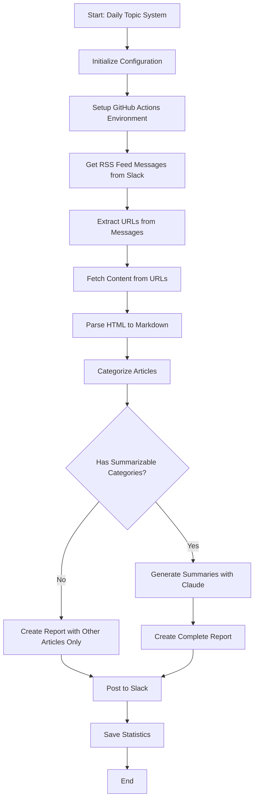
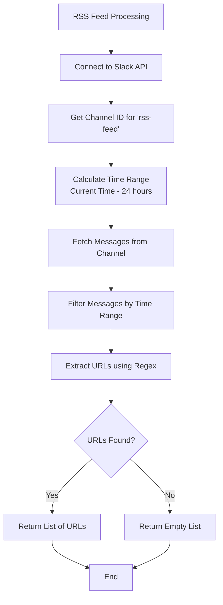
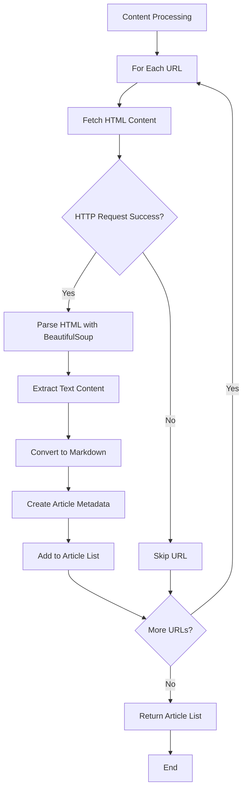
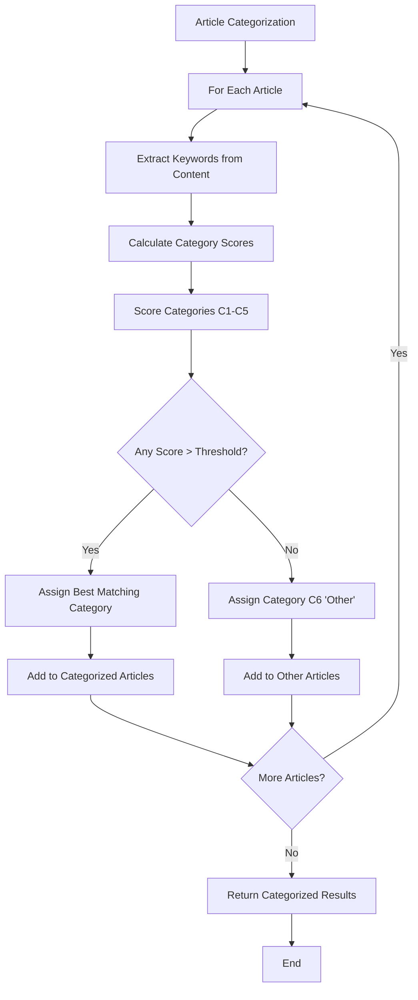
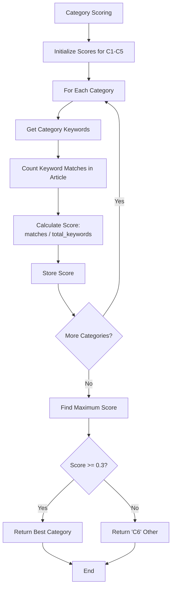
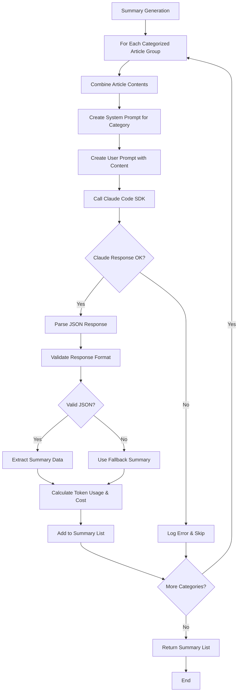
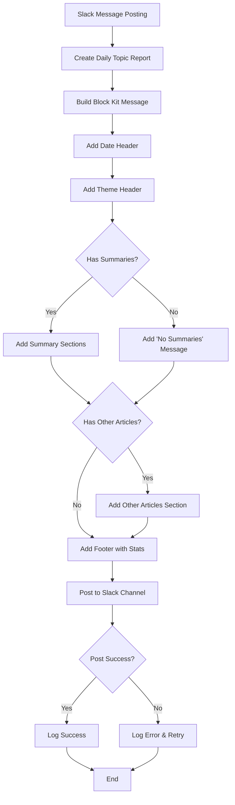
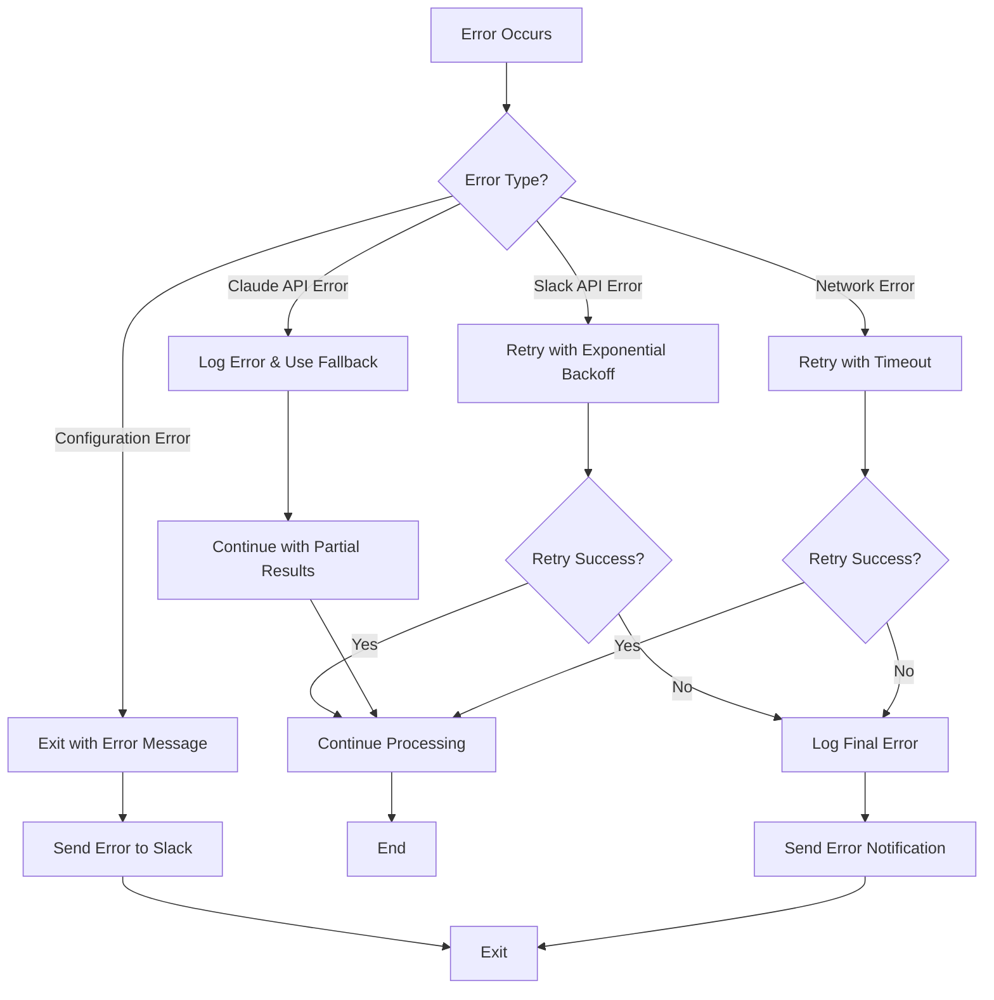

# Daily Topic System Architecture

## Overview

Daily Topic Systemは、SlackのRSSフィードから記事を取得し、Claude Code SDKを使用して要約を生成し、カテゴリ分類してSlackに投稿するシステムです。

## System Flow

### 1. Overall Process Flow



### 2. RSS Feed Processing



### 3. Content Processing Pipeline



### 4. Article Categorization Algorithm



### 5. Category Scoring Details



### 6. Summary Generation with Claude



### 7. Slack Message Posting



### 8. Error Handling Flow



## Category Definitions

| Category | Label                    | Keywords                                                                               |
| -------- | ------------------------ | -------------------------------------------------------------------------------------- |
| C1       | Software-Defined Vehicle | SDV, AUTOSAR, Adaptive AUTOSAR, 車載ソフト                                             |
| C2       | Industrial IoT & Edge    | Industrial IoT, IIoT, スマートファクトリー, Edge Computing                             |
| C3       | Industrial Protocols     | MQTT, OPC UA, OPC UA FX, open62541, TSN, openPLC                                       |
| C4       | Generative AI Tech       | Gemini CLI, Gemini 1.5, Claude 3, Claude Code, OpenAI, Anthropic, Mistral AI, DeepMind |
| C5       | Gen-AI Use Cases         | 生成AI 活用事例, LLM ユースケース, RAG, AI agent, 導入事例, Case Study                 |
| C6       | Other                    | 上記いずれにも当てはまらない場合                                                       |

## Key Algorithms

### 1. URL Extraction from Slack Messages

```python
URL_PATTERN = r'https?://[^\s<>"{}|\\^`[\]]+(?:[^\s<>"{}|\\^`[\].,;:!?)])'
urls = re.findall(URL_PATTERN, message_text)
```

### 2. Category Scoring Algorithm

```python
def calculate_category_score(content: str, keywords: List[str]) -> float:
    content_lower = content.lower()
    matches = sum(1 for keyword in keywords if keyword.lower() in content_lower)
    return matches / len(keywords) if keywords else 0.0
```

### 3. Content Length Optimization

- HTMLコンテンツ: 最大20,000文字
- Claude APIプロンプト: 最大3,000文字
- 要約結果: 最大500文字

### 4. Rate Limiting

- Slack API: 1秒あたり1リクエスト
- Claude API: デフォルト制限に従う
- HTTP取得: 並列処理でタイムアウト10秒

## Configuration

### Environment Variables

- `SLACK_BOT_TOKEN`: Slack Bot Token
- `ANTHROPIC_API_KEY`: Claude API Key
- `RSS_FEED_CHANNEL`: RSS取得チャネル名（デフォルト: "rss-feed"）
- `DAILY_TOPIC_CHANNEL`: 投稿先チャネル名（デフォルト: "daily-topic"）
- `LOOKBACK_HOURS`: 取得対象時間（デフォルト: 24時間）

### GitHub Actions Configuration

- **スケジュール**: 毎日08:00 JST（23:00 UTC）
- **手動実行**: カテゴリ指定・時間指定可能
- **タイムアウト**: 5分
- **エラー通知**: Slackに自動通知

## Performance Characteristics

- **処理時間**: 平均2-3分（記事数により変動）
- **メモリ使用量**: 約100-200MB
- **API呼び出し回数**:
  - Slack API: 3-5回
  - Claude API: カテゴリ数分（最大5回）
  - HTTP取得: URL数分

## Monitoring & Logging

- **ログレベル**: INFO（本番）、DEBUG（開発）
- **統計情報**: `stats/` ディレクトリに保存
- **エラー追跡**: Slackチャネルに通知
- **GitHub Actions**: ワークフロー実行履歴で監視
